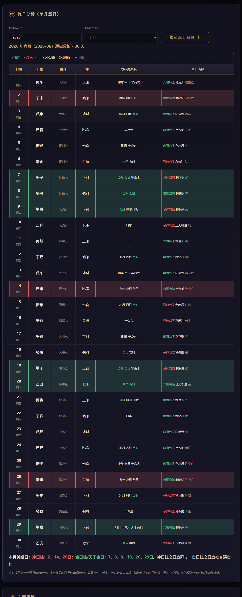
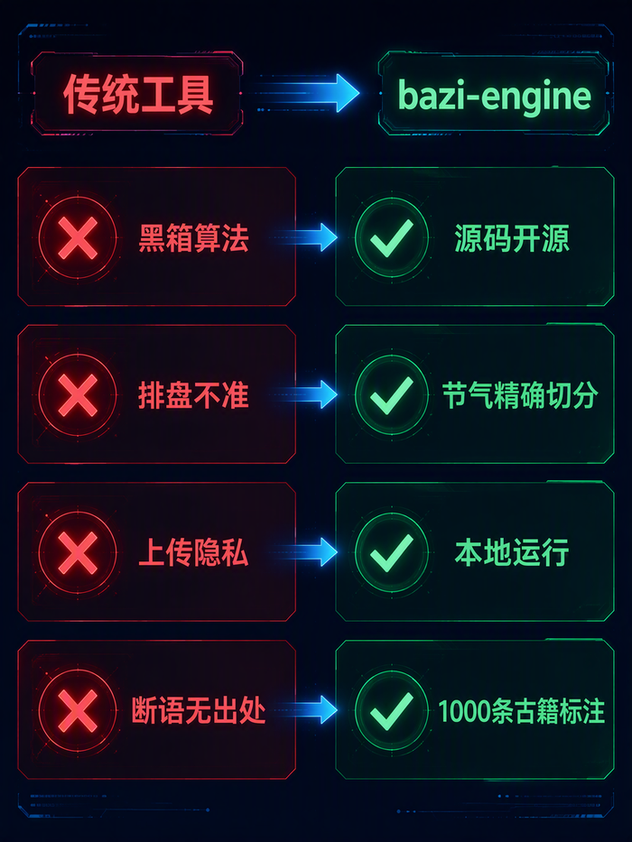
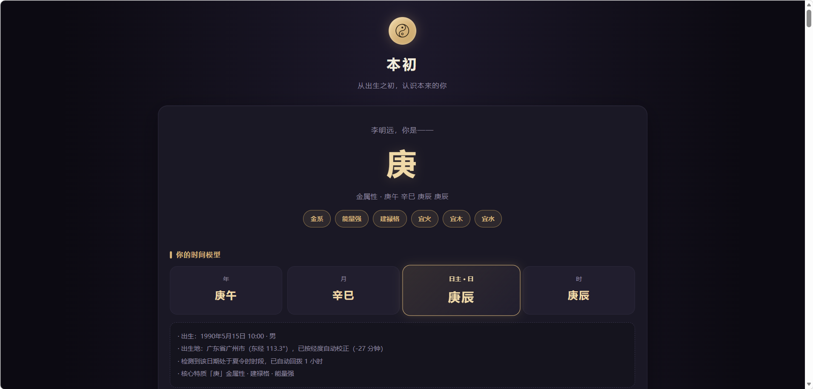
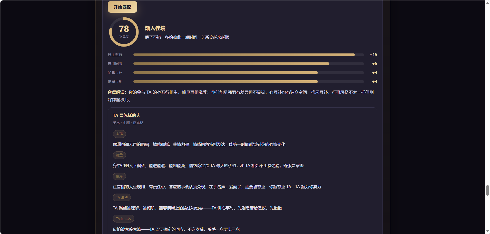
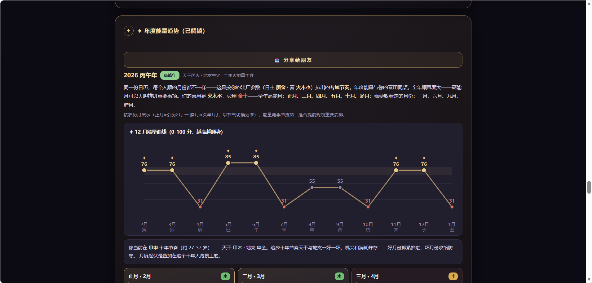
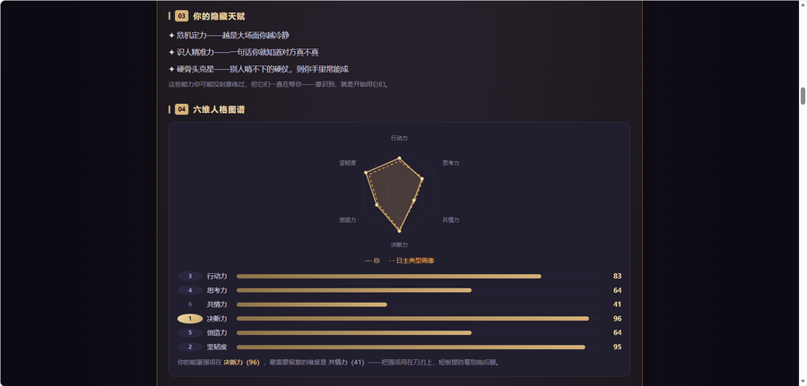
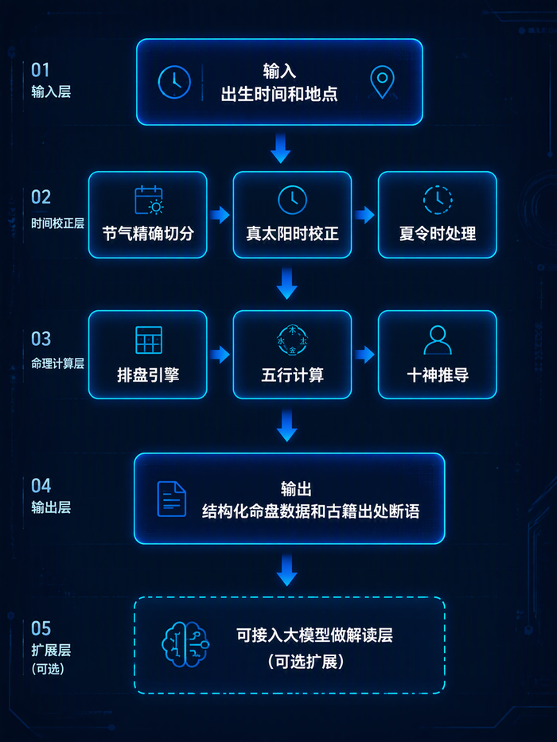

# bazi-engine · 四柱八字命理引擎

一个开箱即用的八字排盘与命理分析 Skill：输入出生信息，自动排出四柱八字、大运流年，并参照经典命理典籍给出带出处的专业解读。

[](https://github.com/ruanxiaoer888/bazi-engine)
[](https://github.com/ruanxiaoer888/bazi-engine/actions)
[](LICENSE)
[](https://skillhub.com/)
[](https://clawhub.ai/ruanxiaoer888/skills/baizi-engine)

> **English**: [README.en.md](README.en.md)  
> **GitHub**: https://github.com/ruanxiaoer888/bazi-engine  
> 🔗 **在线体验**：**[本初 · benchu.xiaoerpro.com](https://benchu.xiaoerpro.com/)** — 基于本引擎的 C 端在线产品

> 单文件离线运行，无任何外部依赖；排盘精确至节气时刻。

## 为什么是引擎？

大多数"AI 算命"产品让大语言模型直接**猜**四柱——而 LLM 恰恰不擅长历法计算。**bazi-engine 从不猜测**：排盘是确定性的、可测试的代码。

- 年柱精确到**立春时刻**，月柱精确到**节气时刻**（基于 206 年 1895–2100 预验证节气数据）
- 日柱按固定六十甲子递归，从规范基准日推算
- 晚子时（23:00+）翻日、真太阳时校正、大运精确至出生时刻

**同一出生数据，永远排出同一张盘。**

## 功能特性

- **排盘引擎**：四柱八字、十神、藏干、纳音、大运（精确至出生时刻起运）、流年、流月、流日
- **流日分析**：任意月份逐日 30 天，每日干支 / 十神 / 与命局冲合刑害 / 空亡 / 喜忌 / 十二长生，自动标记关键日
- **六亲详解**：父母 / 配偶 / 子女 / 兄弟分项分析，宫位为体、十神为用
- **合婚评分**：七大维度综合评分
- **五行补救**：喜用神、调候用神（古籍）、五行缺失与补救建议
- **神煞速查**：24 项吉凶星曜按命中展示
- **三式宫位**：胎元、命宫、身宫
- **断语可追溯**：1000 条断语，每条标注古籍出处（古代命理典籍）与行动建议

<p align="center">
  
  <br/>
  <em>引擎深度能力示例：单月逐日 30 天分析（每日干支 / 十神 / 冲合刑害 / 空亡 / 喜忌 / 十二长生）</em>
</p>

### 为什么选 bazi-engine？

<p align="center">
  
  <br/>
  <em>开源 · 节气精确切分 · 本地零依赖 · 1000 条古籍溯源断语</em>
</p>

## 产品生态

| | 项目 | 说明 |
|---|---|---|
| 🧩 | **bazi-engine**（本仓库） | 开源排盘引擎底座：Skill + 单文件 UI + 独立 JS 库（MIT），面向开发者与命理师 |
| 📦 | **Skill 市场分发** | 已上架 [ClawHub](https://clawhub.ai/ruanxiaoer888/skills/baizi-engine)（OpenClaw 官方市场，安全审计 ✅ 通过）与 [SkillHub](https://skillhub.com/)（腾讯），AI 助手一键安装即用 |
| 🚀 | **[本初](https://benchu.xiaoerpro.com/)** | 作者自有的 C 端在线产品：AI 八字报告（排盘 / 合婚 / 流年），付费解锁，微信支付 |

**开源 → 商业闭环**：引擎开源于 GitHub 供社区使用与二次开发；C 端产品「本初」是作者自有的商业落地，与引擎共用同一确定性排盘内核——C 端仅消费 `paipan` / `applyDst` 等 **MIT 代码层** API，付费解读内容为 C 端自有实现，不涉及 NC 数据。开源获得社区打磨，产品验证商业价值，互相成就。

<p align="center">
  
  <br/>
  <em>排盘结果：四柱命盘 + 五行能量 + 人格解读（以示例命盘展示）</em>
</p>
<p align="center">
  
  
  <br/>
  <em>双人匹配（合婚评分）· 年度能量趋势（逐月提醒）</em>
</p>
<p align="center">
  
  <br/>
  <em>深度报告示例：六维人格图谱（决策力 / 坚韧性等量化评估）</em>
</p>

## 快速开始

### 👤 普通用户 —— 直接体验

- **AI 助手**：从 [ClawHub](https://clawhub.ai/ruanxiaoer888/skills/baizi-engine)（OpenClaw 官方市场）或 SkillHub（腾讯）一键安装本 Skill，直接自然语言对话排盘（见下方「AI 助手」）
- **在线**：访问 [本初 · benchu.xiaoerpro.com](https://benchu.xiaoerpro.com/)（付费报告，微信支付）
- **离线**：浏览器打开 `ui/index.html`（单文件零依赖，`file://` 即可运行）

### 🧑‍💻 开发者 —— 接入引擎

`engine/engine.dist.js` 是独立的 UMD 引擎库（零依赖，导出 101 个 API），浏览器 / Node 双端可用：

```html
<!-- 浏览器 -->
<script src="engine/engine.dist.js"></script>
<script>
  // 性别参数须为 '男' / '女'；applyDst 回拨夏令时（1990 年中国曾实行）
  const d = window.BaziEngine.applyDst(1990, 5, 15, 10);           // {hh: 9, dst: 1}
  const c = window.BaziEngine.paipan('李明远', '男', 1990, 5, 15, d.hh, 0, '广州市', 'yes');
  console.log(c.yg, c.mg, c.dg, c.hg); // 庚午 辛巳 庚辰 庚辰
</script>
```

```js
// Node.js
const BaziEngine = require('./engine/engine.dist.js');
const d = BaziEngine.applyDst(1990, 5, 15, 10);
const c = BaziEngine.paipan('李明远', '男', 1990, 5, 15, d.hh, 0, '广州市', 'yes');
console.log(c.yg, c.mg, c.dg, c.hg); // 庚午 辛巳 庚辰 庚辰
```

核心 API：`paipan`（排盘）/ `matchRules`（断语匹配）/ `applyDst`（夏令时校正）/ `lunarToSolar`（农历转阳历）/ `calcShenSha`（神煞）/ `getDaYun`（大运）等。

### 🤖 AI 助手 —— 调用 Skill

通过支持 Skill 的 AI 助手（WorkBuddy / DeepSeek Harness / Codex / OpenClaw 等）调用本 Skill。

本 Skill 已上架两大 Skill 市场，均可一键安装：

- **ClawHub**（OpenClaw 官方市场）：[clawhub.ai/ruanxiaoer888/skills/baizi-engine](https://clawhub.ai/ruanxiaoer888/skills/baizi-engine) · 安全审计 ✅ 通过 · 与 GitHub 仓库自动同步（push 即更新）

  ```bash
  openclaw skills install @ruanxiaoer888/baizi-engine
  ```

- **SkillHub**（腾讯）：平台内搜索 `bazi-engine` 一键安装

安装后：

1. 告诉我你的出生信息：姓名、生日（阳历或农历均可）、出生时间、性别、出生地
2. 自动排盘并输出：四柱命盘 → 五行分析 → 大运流年 → 综合解读
3. 可继续追问流年 / 流月 / 流日 / 合婚 / 六亲等深入分析

### 示例对话

**Q：** 帮我算一下八字，1990年5月15日上午10点，男，广州出生。

**A：** 排出四柱（庚午 辛巳 庚辰 庚辰，含夏令时回拨 + 真太阳时校正说明）、五行分布、喜用神，并给出大运 8 步与当前流年解读（每条断语附古籍出处）。

**Q：** 看看我和她合不合，我1990年5月15日10点男广州，她1992年8月8日20点女北京。

**A：** 七大维度合婚评分（日主互补 / 五行相生 / 六亲对照 / 流年同步等），并标注相合与相冲之处。

**Q：** 2026年3月哪天适合谈合作？

**A：** 展开流日分析：逐日标注冲合日柱、喜用忌神日，汇总本月关键日，给出"冲日宜静守、合日宜社交"的建议。

## 技术说明

- **UI**：`ui/index.html` — 单文件离线（零外部依赖），内置 206 年节气数据 + 1000 条断语
- **构建**：`tools/build_ui.py`（Python）内联节气与断语库生成 UI
- **验证**：13 套回归脚本，覆盖引擎库、农历、夏令时、输入容错、边界场景、报告质量与端到端用户视角，CI 自动执行

  <details>
  <summary>13 套回归脚本清单（点击展开）</summary>

  ```
  tools/test_engine.js       工具链审计（28 项，独立库直测）
  tools/test_lunar.js        农历模块（27 项）
  tools/test_ui.js           UI 功能回归
  tools/test_eval_state.js   旺衰状态机
  tools/test_p1_fixes.js     P1 修复回归
  tools/verify_sleep_rules.js 十二长生规则
  tools/verify_ux_e2e.js     端到端用户视角
  tools/test_dst.js          夏令时
  tools/test_liuri_v2.js     流日分析
  tools/test_liuyue_v2.js    流月分析
  tools/verify_edu_rules.js  学业规则
  tools/test_xiyong.js       喜用神
  tools/check_conflicts.js   反义矛盾检测
  ```
  </details>
- **CI 门禁**：`.github/workflows/ci.yml`（GitHub Actions）在每次 push / PR 时自动构建 UI 与引擎 dist、校验断语库 JSON、跑 13 套回归 + 命中分布审计，全绿方可合并——质量保障由机器人把关
- **跨平台一致性**：`.gitattributes` 强制构建产物与数据文件使用 LF 换行（Windows CRLF 曾导致 dist 字节不一致、MD5 无法跨平台对齐），保证本地 / CI / C 端三方字节一致
- **质检工具**：`audit_hit_distribution.js`（命中分布审查）、`check_dup_hits.js`（重复命中检测）、`check_conflicts.js`（反义矛盾检测）

<p align="center">
  
  <br/>
  <em>处理链路：输入 → 时间校正（夏令时 / 真太阳时）→ 命理计算 → 结构化输出 → 可选 AI 解读</em>
</p>

## 目录结构

```
skill/SKILL.md           Skill 定义（引导式交互 + 分析流程）
ui/index.html            单文件离线界面
engine/engine.dist.js    独立引擎库（UMD：浏览器 / Node 双端可用）
tools/                   构建 / 测试 / 质检工具
kb/                      古籍原文 + 规则手册 + 断语库
.github/workflows/       CI 门禁（GitHub Actions：构建 + 回归 + 审计）
.gitattributes           LF 换行规范（跨平台产物一致性）
```

## 免责声明

本工具基于传统命理典籍（子平法）进行排盘与推演，结果仅供文化研究与娱乐参考，不构成医疗、投资、法律等任何专业建议。命理之说，信则有，不信则无，请理性看待。

## 数据溯源指纹

断语库（`kb/04-rules-db/rules.json`）内含**溯源指纹句**（水印，具体位置不公开）。未经许可复用本断语库（如直接搬运数据做商业产品），指纹句会原样出现在对方内容中，可据此识别与取证。遵守 [LICENSE](LICENSE) / [LICENSE-DATA](LICENSE-DATA) 的正常使用不受任何影响。

## License

本仓库采用**双许可**结构：

- **代码**（排盘引擎 / UI / 构建测试脚本 / Skill 定义）：[MIT](LICENSE) — 自由使用
- **数据**（`kb/` 断语库与古籍汇编等）：[CC BY-NC-SA 4.0](LICENSE-DATA) — 署名 · 非商业 · 相同方式共享（古籍原文属公有领域，可自由引用）

> **商业边界**：「本初」为作者自有商业产品（作者对自有代码与数据享有完整权利）；第三方使用本仓库仍按上方双许可执行（代码 MIT / 数据 CC BY-NC-SA 4.0），商业授权请联系作者。
>
> **市场分发**：本 Skill 在 [ClawHub](https://clawhub.ai/ruanxiaoer888/skills/baizi-engine) / SkillHub 等市场分发时同样适用上述双许可——若市场页面的 License 字段与本仓库不一致，以本仓库 [LICENSE](LICENSE) / [LICENSE-DATA](LICENSE-DATA) 为准。
>
> 双许可边界、来源归属与商业授权说明详见 [LICENSE-DATA](LICENSE-DATA)。

## 支持作者

如果本项目对你有帮助，欢迎 [Star ⭐](https://github.com/ruanxiaoer888/bazi-engine) 或在 [本初](https://benchu.xiaoerpro.com/) 体验付费报告；商业授权 / 定制合作 / 反馈建议请联系作者：

<p align="center">
  
  <br/>
  <em>微信：<code>feizi6651</code>（扫码或搜索添加）· 公众号：AI 知识分享</em>
</p>
